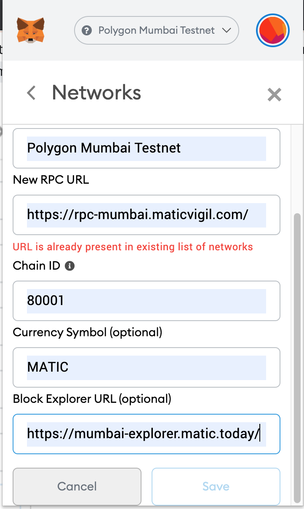
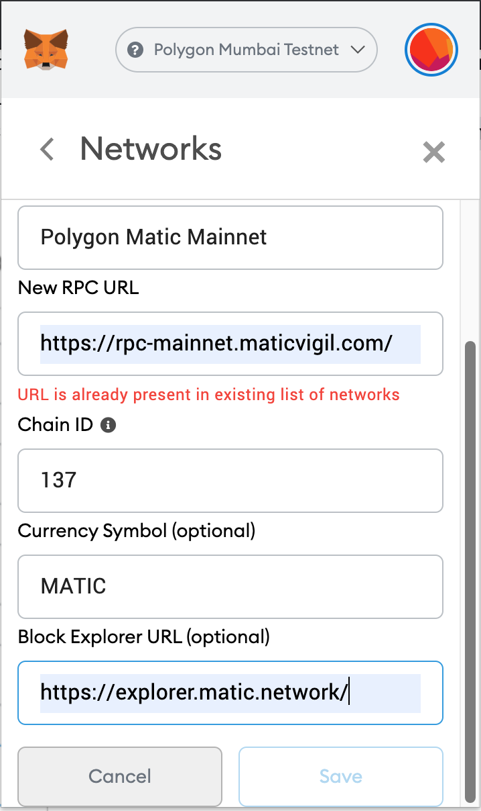

# NFT Collectibles Masterclass project deployed on Polygon/Matic network

### About
Dapp University NFT Collectibles Masterclass project deployed to Polygon/Network 
[Read accompanying document on Polygon](https://docs.google.com/document/d/1iqX6hLNrKw80mvW0aXwOE6rmmcoMcfAM8NcSiXRE-_o/edit?usp=sharing)  

### Technology Stack and Tools

* [NodeJS](https://nodejs.org/en/)
* [Node Version Manager](https://heynode.com/tutorial/install-nodejs-locally-nvm)
* [Polygon/Matic](https://polygon.technology/)
* [ERC721](https://docs.openzeppelin.com/contracts/3.x/erc721)
* [Metamask Wallet](https://metamask.io/)
* [Truffle](https://www.trufflesuite.com/) - development framework
* [React](https://reactjs.org/) - front end framework
* [Solidity](https://docs.soliditylang.org/en/v0.7.4/) - ethereum smart contract language
* [Ganache](https://www.trufflesuite.com/ganache) - local blockchain development
* [Web3](https://web3js.readthedocs.io/en/v1.3.0/) - library interact with ethereum nodes 
* [JavaScript](https://www.javascript.com/) - logic front end and testing smart contracts
* [Infura](https://infura.io/) - connection to ethereum networks 
* [Open Zeppelin](https://infura.io/) - smart contract libraries 

##### Folder / Directory Structure (key folders)
* NFT Collectibles Masterclass
  * node_modules
  * public 
    * index.html
  * src
    * backEnd
        * abis
        * contracts
        * migrations
        * scripts
        * test
    * components
    * images
    * store
    * index.js
    * .env
    * .env.example
    * truffle.js
    * package.json

### Preconfiguration, Installation and Running project locally 

1. You will need nvm to install specific version node v12.10.0
```sh
$ curl -o- https://raw.githubusercontent.com/nvm-sh/nvm/v0.37.2/install.sh | bash
$ source ~/.nvm/nvm.sh
```
Restart your terminal

2. Install node v12.10.0
```sh
$ nvm install 12.10.0
$ nvm alias default 12.10.0
```

3. Install truffle globally
```sh
$ npm install -g truffle
```

4. If opting to use ganache-cli vs [Ganache GUI](https://www.trufflesuite.com/ganache), install ganache-cli globally
```sh
$ npm install -g ganache-cli
```

5. Enter project directory and install dependancies
```sh
$ cd nft_masterclass_1
$ npm install 
```

### Migrating contracts and Testing Locally to ensure all is working well

1. To compile contracts e.g you make changes to contracts
```sh
$ truffle compile 
```

2. To test contracts 
```sh
$ truffle test
```

Make sure your truffle.js or truffle-config.js file is properly configured for development environment.
3. Migrate contracts to local running instance ganache
```sh
$ truffle migrate --reset 
```

4. Interact with locally deployed contracts and excute script to mint tokens
```sh
$ truffle develop
$ migrate --reset
$ exec src/backEnd/scripts/mint.js
$
```

### Front End and how to use Dapp
1. Run app locally 
```sh
$ npm start
```
Enter dApp in browser at localhost:3000

### Deploying to Polygon/Matic Mumbai testnet network

You can also read up on our [Polygon document here](https://docs.google.com/document/d/1iqX6hLNrKw80mvW0aXwOE6rmmcoMcfAM8NcSiXRE-_o/edit?usp=sharing)

1. Setup up Polygon/Matic network on Metamask. In Metamask Networks -> Select Custom Network and 
configure as below images 





1. You will need Matic tokens in an account that will deploy contract
We will get MATIC tokens from faucet [https://faucet.matic.network/](https://faucet.matic.network/) into 
a Metamask Account

1. Ensure truffle is configured for Polygon Matic Mumbai network with added configuration like below
```sh
module.exports = {
  networks: {
    development: {
      ...
    },
    matic: {
      provider: () => new HDWalletProvider(mnemonic, `https://rpc-mumbai.matic.today`),
      network_id: 80001,
      confirmations: 2,
      timeoutBlocks: 200,
      skipDryRun: true
    },
  },
  ...
```

2. Deploy using truffle. Ensure you ganache instance is still running or running
```sh
$ truffle migrate --network matic
```

3. 
